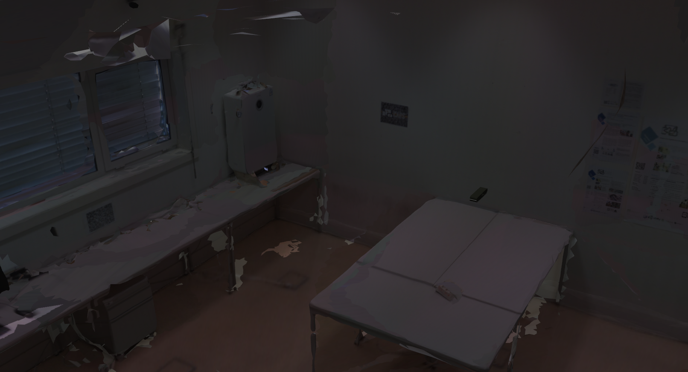
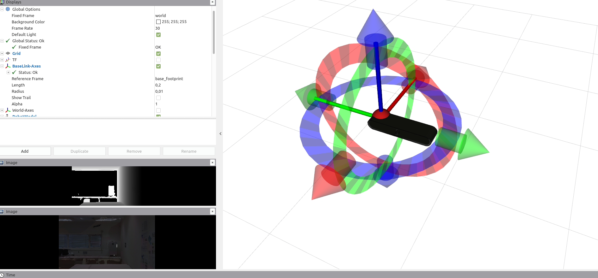

# localization_end_to_end

**Local**ization **Bot** (localbot) is a conceptual robot designed to test end-to-end localization algorithms. The system contains the following sensor:

- **hand_camera** - A RGB-D camera






### Add to .bashrc:

```
export GAZEBO_MODEL_PATH="`rospack find localbot_gazebo`/models:${GAZEBO_MODEL_PATH}"
```

# Running the simulation

To launch the gazebo with the room_024.world run:

    roslaunch localbot_gazebo localbot.launch

To spawn the robotic system into the gazebo run:

    roslaunch localbot_bringup bringup.launch

# Collecting the data

In each frame we store:

- **frame-X.pcd** - The point cloud w.r.t. the rgb_frame
- **frame-X.pose.txt** - The 4x4 transformation matrix from world to rgb_frame
- **frame-X.rgb.png** - The rgb image

For collecting each frame, we have four options:

1.  **interactive**

        rosrun localbot_core data_collector --mode interactive --seq 1 

Here we have to manually drag the interactive marker and click on another marker to save each frame of the dataset.

2.  **automatic_random**

        rosrun localbot_core data_collector --mode automatic_random --seq 1 -ns 20 

In this case, in each frame, it is generated a random pose. Here we do not have any movement between poses.

video:

https://uapt33090-my.sharepoint.com/:v:/g/personal/danielsilveiracoelho_ua_pt/ERR9giFm8ZREiKSNzqZQNaABZ38q4M1HU_Zte4d_4e1Zxg?e=oGkjRv

3.  **automatic_path** with random poses 

        rosrun localbot_core data_collector --mode automatic_path --seq 1 -ns 20 

In this case, it is generated a random pose, and then the camera moves towards that pose in a continuous movement. As soon as the pose is reached, another pose is generated, and so on... One hyperparameter that must be defined is the number of steps (n_steps). Basically, it is the number of iterations between the initial pose and the final pose. 

video: 

https://uapt33090-my.sharepoint.com/:v:/g/personal/danielsilveiracoelho_ua_pt/Ef34nF86NIVEsGxx6OH2jE8BbOZAVPP9-_WT9ltrG2xr0g?e=xPEihX


4.  **automatic_path** with the desired pose 

        rosrun localbot_core data_collector --mode automatic_path --seq 1 --ns 20 --destination_pose '1,4,0,0.5,0.2,1.5'

In this case, we have to define where we want the model to go, and then a path is generated towards that pose. 


