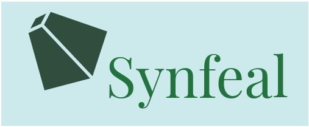

# Synfeal: A Data-Driven Simulator for Camera Localization

**Synfeal** (*Synthetic from Real*) synthesizes large localization datasets free of inconsistencies based on realistic 3D reconstructions of the environment.
For instructions on how to install and use, **check the documentation** (work in progress).

For a demonstration of the data collection procedure, see the following video:

<a href="https://www.youtube.com/watch?v=sRxalb6BoFs&ab/">https://www.youtube.com/watch?v=sRxalb6BoFs&ab/</a>

 

# Documentation

## Requirements

    pip3 install -r /synfeal/requirements.txt
   
    mkdir $HOME/datasets
    mkdir $HOME/models
    mkdir $HOME/results
    mkdir $HOME/models_3d

Add to zsh or bash file:

    export GAZEBO_MODEL_PATH="`rospack find synfeal_bringup`/models:${GAZEBO_MODEL_PATH}"

## How to launch the system?

First launch the texture mesh:

    roslaunch synfeal_bringup bringup_mesh.launch world:=santuario.world

Then launch the virtual camera:

    roslaunch synfeal_bringup bringup_camera.launch

## How to collect the data?

Run:

    rosrun synfeal_collection data_collector -nf 100000 -m <mode> -mc 'santuario.yaml' -s name_of_the_dataset

where mode can be one option of the following: **interactive**, **random**, **path**.

Adapt the yaml file according to your needs.

Activate the flag -f just to collect the RGB image and the corresponding pose.

## How to process the dataset?

Run:

    cd synfeal/process_dataset/scripts && ./process_dataset -d name_of_the_dataset -s '_processed' -fi 0.5 -pts 1000

Or, in the case of when -f is activated, run:

    cd synfeal/process_dataset/scripts && ./create_statistics -d name_of_the_dataset

Then validate the dataset with:

    ./validate_dataset -d name_of_the_dataset

## How to train the algorithms?

If you want to use the PoseNet with Beta Loss run:

    ./rgb_training -fn posenet_beta_lab024_50k -mn posenetgooglenet -train_set seq41 -test_set seq42 -n_epochs 300 -batch_size 45  -loss 'BetaLoss(100)' -c -im 'PoseNetGoogleNet(True,0.8)' -lr_step_size 60 -lr 1e-4 -lr_gamma 0.5 -wd 1e-2 -gpu 2

For informations on how to use other models, see https://github.com/DanielCoelho112/synfeal/blob/main/models/readme.md#L5

## How to produce the results?

Run:

    ./process_results/rgb_produce_results -test_set 'seq22_p0r20' -rf <results_folder> -mp <model_name>

## How to visualize the results?
